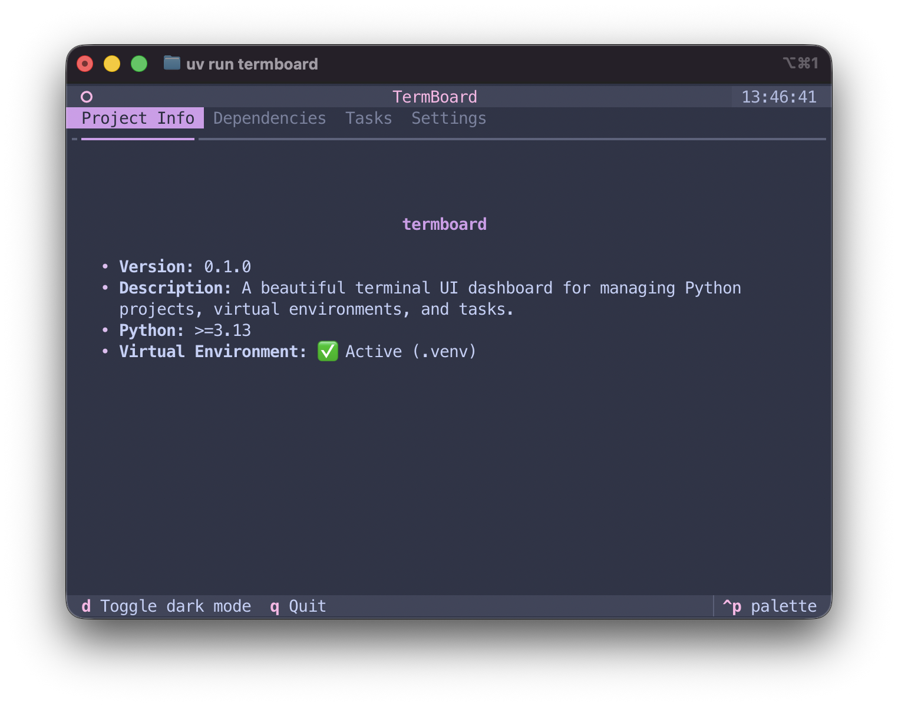
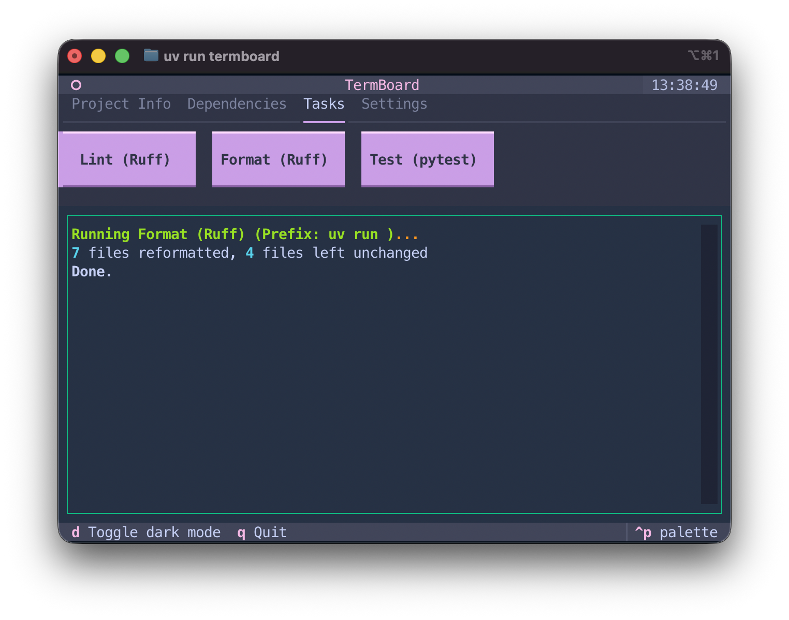
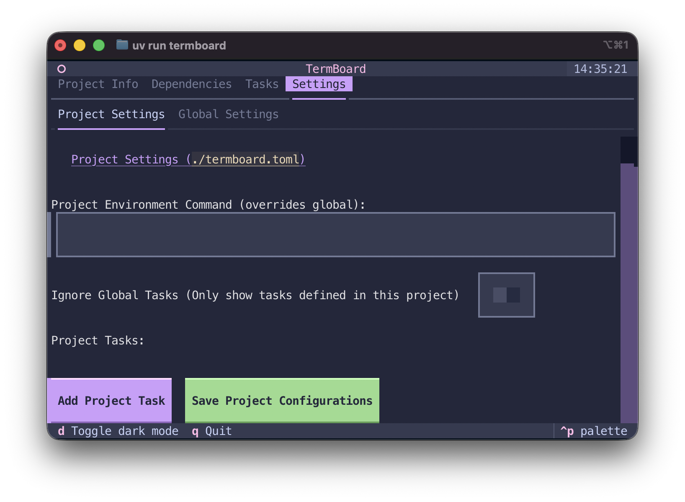
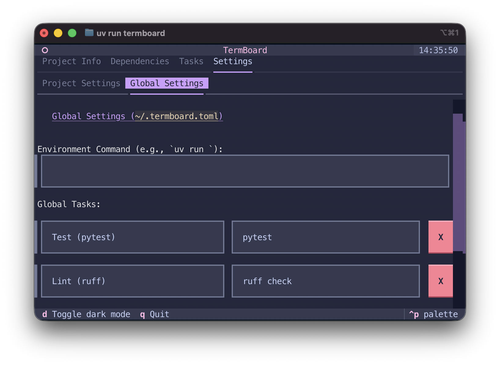
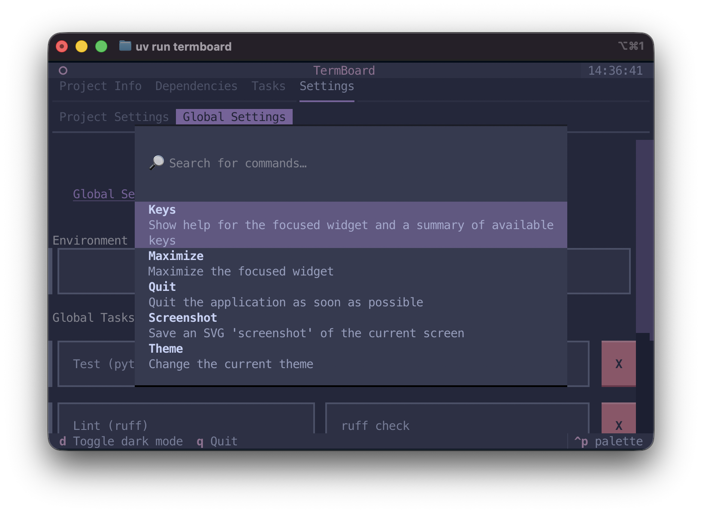

# ✨ Features

TermBoard is packed with powerful features designed to make managing your Python projects easier. Here is a visual tour of what it can do.

---

### 📋 Project Info
Instantly see your project's version, python requirements, and virtual environment status.

---

### 📦 Visual Package Manager (PyPI)
Search PyPI for packages, read descriptions, and install directly using `uv add` natively in the terminal.

---

### 🌿 Git Integration
Shows current branch, uncommitted changes, and provides actions to stage, unstage, commit, and push.

---

### 🐳 Docker Services
View, start, stop, and delete running Docker containers without leaving the dashboard.

---

### 🚀 Task Runner
Define and execute custom project tasks via `./termboard.toml` or `~/.termboard.toml`. Toggle interactive tasks to suspend the UI!

---

### 🐙 GitHub Integration
Browse active pull requests, monitor GitHub Actions workflow statuses, and track Issues natively.

---

### ⚙️ In-App Settings
Override environment variables, add new custom tasks, and save configurations either project-wide or globally.

---

### 📁 Global Workspaces
Easily switch between your recent projects using the `Ctrl+P` Quick Switcher. TermBoard remembers where you've been.
